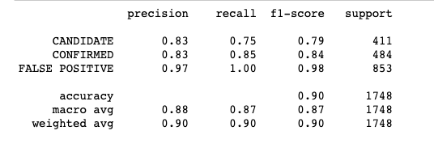
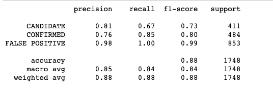
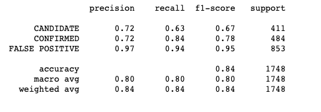

# Machine Learning Homework - Exoplanet Exploration

### Before You Begin

1. Create a new repository for this project called `machine-learning-challenge`. **Do not add this homework to an existing repository**.

2. Clone the new repository to your computer.

3. Give each model you choose their own Jupyter notebook, **do not use more than one model per notebook.**

4. Save your best model to a file. This will be the model used to test your accuracy and used for grading.

5. Commit your Jupyter notebooks and model file and push them to GitHub.

## Note

Keep in mind that this homework is optional! However, you will gain a much greater understanding of testing and tuning different Classification models if you do complete it.

## Background

Over a period of nine years in deep space, the NASA Kepler space telescope has been out on a planet-hunting mission to discover hidden planets outside of our solar system.

To help process this data, you will create machine learning models capable of classifying candidate exoplanets from the raw dataset.

In this homework assignment, you will need to:

1. [Preprocess the raw data](#Preprocessing)
2. [Tune the models](#Tune-Model-Parameters)
3. [Compare two or more models](#Evaluate-Model-Performance)

- - -

## Instructions

### Preprocess the Data

* Preprocess the dataset prior to fitting the model.
* Perform feature selection and remove unnecessary features.
* Use `MinMaxScaler` to scale the numerical data.
* Separate the data into training and testing data.

### Tune Model Parameters

* Use `GridSearch` to tune model parameters.
* Tune and compare at least two different classifiers.

### Reporting

* Create a README that reports a comparison of each model's performance as well as a summary about your findings and any assumptions you can make based on your model (is your model good enough to predict new exoplanets? Why or why not? What would make your model be better at predicting new exoplanets?).

- - -

## Analysis
##### Model 1: Random Forest 

* Training Score Before Tuning: 1.0
* Testing Score Before Tuning: 0.8993
* Training Score After Tuning:  1.0
* Testing Score After Tuning: 0.8976

##### Model 2: Support Vector

* Training Score Before Tuning: 0.8455
* Testing Score Before Tuning: 0.8415
* Training Score After Tuning: 0.8865
* Testing Score After Tuning: 0.8793

##### Model 3: KNN 

* Training Score Before Tuning: 0.869
* Testing Score Before Tuning: 0.831
* Training Score After Tuning: 0.864
* Testing Score After Tuning: 0.839

Each of the models acheived a high level of accuracy in classifying the exoplanets and would do a good job of predicted new ones. The Random Forest Model had the highest level of accuracy in classifying Candidate and Confirmed exoplanets, but the Support Vector Model classified False Positives more accuratly by one percentage point than the Random Forest Model. The K Nearest Neighbor Model was the least accurate and the least percise. The Support Vector Scores improved the most from Tuning the data. 

